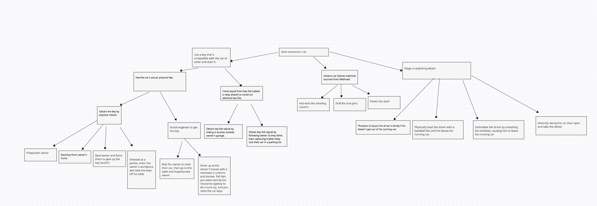
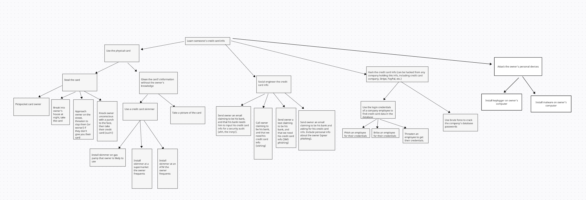

# Homework 1
Carter Sullivan
Professor Palmer
COSC 55
9/26/2023

## Part A

1. Create an attack tree for stealing a car

  

2. Create an attack tree for learning someone's credit card information.

  

## Part B

Produce a threat model using the OWASP Dragon software for the following
scenario:

*"Consider a system that allows a surgeon in one city to assist in an operation
on a patient in another city via an internet connection. Think about how the
trust boundaries could be defined. Think about how an adversary might
interfere with this system, then harden the system with countermeasures."*

  

